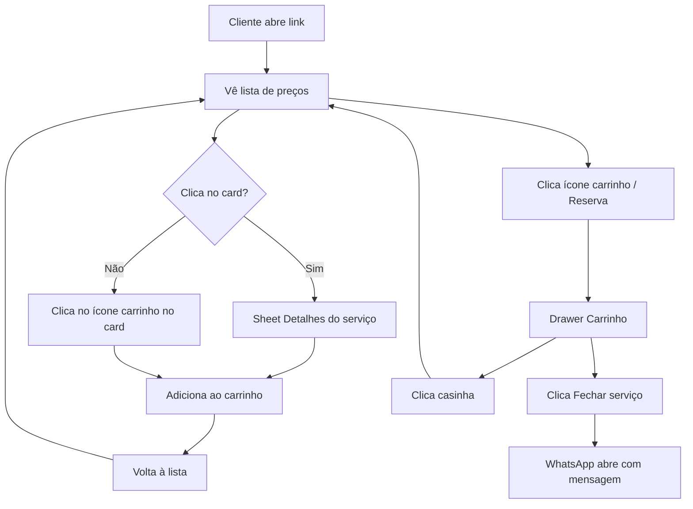
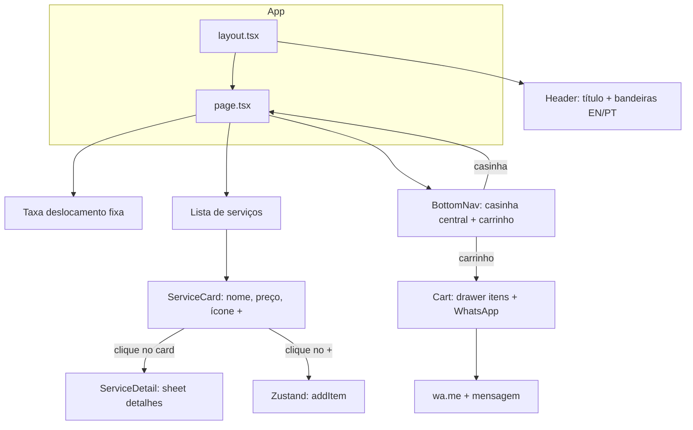
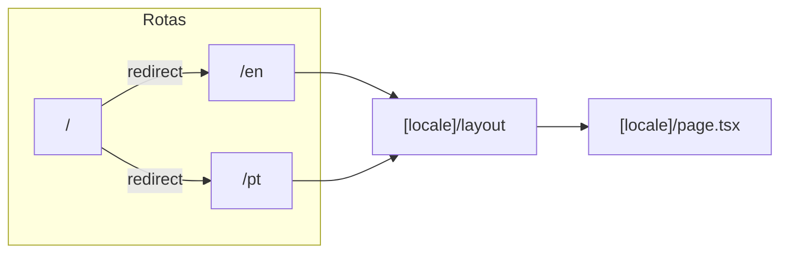
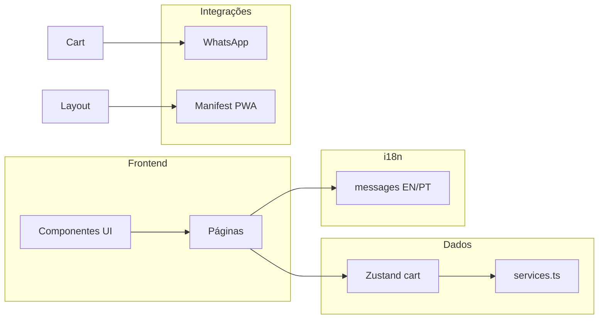

# Arquitetura — Waxing Athens

Documentação da estrutura e fluxos do app (diagramas em Mermaid; o GitHub renderiza automaticamente).

---

## Fluxo do usuário (cliente no celular)

---

## Telas e componentes (frontend)

---

## Rotas e i18n

- **Raiz:** `app/page.tsx` redireciona para `/en`.
- **Locale:** Conteúdo em `app/[locale]/`; layout com `NextIntlClientProvider`; mensagens em `messages/en.json` e `messages/pt.json`.

---

## Camadas do projeto

---

## Stack

| Camada   | Tecnologia                       |
|----------|----------------------------------|
| Framework| Next.js 14 (App Router)          |
| Estilo   | Tailwind CSS                     |
| Animações| Framer Motion                    |
| Estado   | Zustand + persist (localStorage) |
| i18n     | next-intl (EN/PT)                |
| Ícones   | lucide-react                     |
